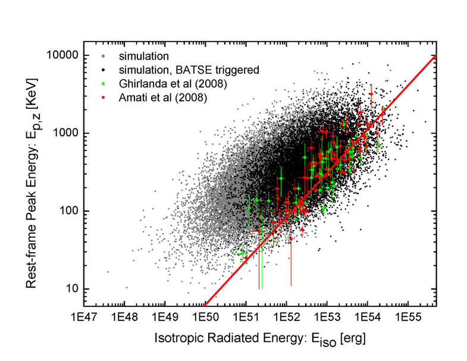
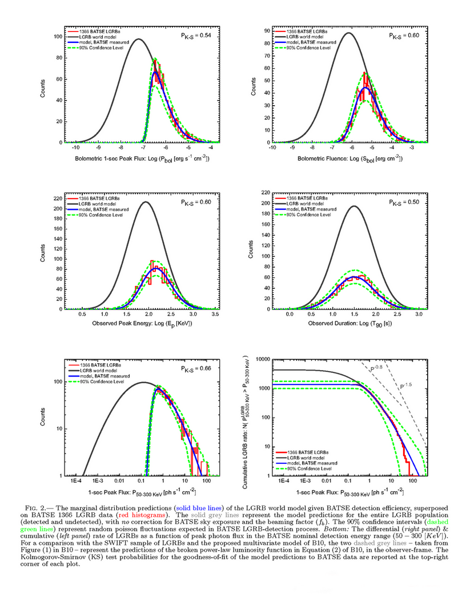

<b>A Brief (incomplete) Introduction to the Story: </b>

The <a href="http://en.wikipedia.org/wiki/Luminosity_function_%28astronomy%29" target="_blank"> Luminosity Function</a> (LF) of <a href="http://en.wikipedia.org/wiki/Gamma-ray_burst#Long_gamma-ray_bursts" target="_blank">Long-duration Gamma-Ray Bursts</a> (LGRBs) has been subject of many researches in GRB community. Early attempts to constrain the LF of LGRBs in the <a href="http://en.wikipedia.org/wiki/Compton_Gamma_Ray_Observatory#BATSE" target="_blank">BATSE</a> era were primarily aimed at finding the true origin of LGRBs: Cosmological vs. Galactic. Back in the 90' there was a <a href="http://apod.nasa.gov/diamond_jubilee/debate95.html" target="_blank">great debate and suspicion</a> about the cosmological origin of LGRBs with some scientists arguing that a cosmological origin for GRBs would imply an enormous output of energy on the order of. 1051 [erg] in a matter of a few seconds. Nevertheless, observations of the GRB afterglows in the late 90' and the <a href="http://www.nature.com/nature/journal/v387/n6636/full/387878a0.html" target="_blank">first measurement of a GRB redshift</a>, ruled out the galactic models as a potential candidate for GRBs, or at best, for many classes of Gamma-Ray events. Now with GRB distance puzzle being solved, researchers turned into other interesting aspects of these bursts, such as the studies of GRB energetics and the correlations among the spectral parameters of the prompt gamma-ray emission from (mostly) LGRBs. Most prominently, some observational astronomers reported strong correlations between the total isotropic emission of the gamma-ray energies (Eiso), or the isotropic peak luminosity (Liso) and [the spectral peak energies (EP,z)]() of LGRBs. Such correlations were later criticized by some other researchers for the lack of significance and sample incompleteness. The culprit here turns out to be the unknown complex selection effects in the GRB detection mechanism, spectral analysis, and redshift measurement which modify the observed sample of LGRBs from the true underlying population without leaving a clear trace. Nevertheless, the debate still goes on to this date among GRB researchers (c.f. <a href="https://sites.google.com/site/amshportal/research/aca/in-the-news/perception-and-bias" target="_blank">Shahmoradi &amp; Nemiroff 2011</a> for a complete review).

  
<b>Motivation:</b>
  

The goal of the presented analysis was to derive a multivariate model capable of reproducing the joint 4-dimensional distribution of 4 spectral parameters of 1366 BATSE LGRBs:

-- Liso: the isotropic peak luminosity  
-- Eiso: the isotropic total emission   
-- EP,z: the comoving-frame time-integrated spectral peak energy  
-- T90,z: the comoving-frame duration  

Examples of multivariate treatment of LGRB data are rare in Gamma-Ray Burst literature, with the most recent (and perhaps the only) such work presented by <a href="http://adsabs.harvard.edu/abs/2010ApJ...711..495B" target="_blank">Butler et al. (2010)</a>. Conversely, many authors have focused primarily on the univariate distribution of the spectral parameters, most importantly on the luminosity function (LF). A variety of univariate models have been proposed as the LGRB LF and fit to data by approximating the complex detector threshold as a step function (e.g., <a href="http://adsabs.harvard.edu/abs/1999ApJ...523L.117S" target="_blank">Schmidt 1999</a>) or an efficiency grid (e.g. the four-interval efficiency modeling of <a href="http://adsabs.harvard.edu/abs/2005ApJ...619..412G" target="_blank">Guetta et al. 2005</a>) or by other approximation methods. A more accurate modeling of the LF, however, requires at least two LGRB observable incorporated in the model: the observed bolometric peak flux (Pbol) and the observed spectral peak energy (EP). The parameter EP is required, since most gamma-ray detectors are photon counters, a quantity that depends on not only Pbol but also on the <i>observed</i> spectral peak energy (EP) of the burst. This leads to the requirement of using a bivariate distribution as<i> the minimum acceptable model to begin with</i>, for the purpose of constraining the LF. The choice of model can be almost anything, since the current theories of LGRBs prompt emission do not set strong limits on the shape and range of the luminosity function (or any other LGRB spectral variables).

<b>A 4-D Multivariate Model of LGRBs Spectral Parameters:</b> 
  

  

Here, the multivariate <a href="http://en.wikipedia.org/wiki/Log-normal_distribution" target="_blank">log-normal distribution</a> is proposed as the simplest natural candidate model capable of describing data. The motivation behind this choice of model comes from the available observational data that closely resembles a joint multivariate log-normal distribution for four most widely studied spectral parameters of LGRBs in the observer-frame:

-- Pbol: the bolometric peak flux  
-- Sbol: the bolometric fluence  
-- Ep: the observed spectral peak energy  
-- T90: the observed duration  

Since most LGRBs originate from moderate redshifts z~1-3 (<a href="http://adsabs.harvard.edu/abs/2010ApJ...711..495B" target="_blank">a fact known thanks to Swift satellite observations</a>), the convolution of these observer-frame parameters with the redshift distribution results in negligible variation in the shape of the comoving-frame joint distribution of the same LGRB parameters. Therefore, the redshift-convoluted 4-Dimensional (4D) observer-frame distribution can be well approximated as a linear translation from the observer-frame parameter space to the comoving-frame parameter space, keeping the shape of the distribution almost intact. This implies that the joint distribution of the intrinsic LGRB variables: the isotropic peak luminosity (Liso), the total isotropic emission (Eiso), the rest-frame spectral peak energy (Ep,z), and , the rest-frame gamma-ray duration (T90,z) might be indeed well described by a multivariate log-normal distribution.
 
  
<b>Model fitting:</b>
  

For this study, LGRB data were collected from the largest catalog of bursts available to date: <a href="http://www.batse.msfc.nasa.gov/batse/grb/catalog/" target="_blank">BATSE 2130 GRBs</a>. First, an elaborate method to separate the two classes of GRBs: Short vs. Long was devised. Details of the methods used are described in Shahmoradi (2012). Then the proposed quadru-variate LGRB world model, convolved with BATSE trigger threshold was fit to the observational data of <a href="https://docs.google.com/spreadsheet/ccc?key=0ApSwPt7SvosHdGFxajVzclo5SDdzOWdMTWMybkhwbmc#gid=0" target="_blank">1366 BATSE LGRBs</a>. The best-fit parameters were obtained by maximizing the likelihood function of the model given BATSE data, by setting up a <a href="http://en.wikipedia.org/wiki/Markov_chain" target="_blank">Markov Chain</a> to randomly explore the likelihood space for the global maximum. Extensive <a href="http://en.wikipedia.org/wiki/Goodness_of_fit" target="_blank">goodness-of-fit</a> tests were performed to ensure the model adequately describes data.

Here is an example prediction of the LGRB world model for the well-known Eiso-EP,z (<a href="http://www.iasfbo.inaf.it/%7Eamati/" target="_blank">the Amati</a>) relation:

  

  

and here is an example plot of the reconstruction of the univariate BATSE LGRB data measured in the observer-frame according to the best-fit parameters:

  

   

